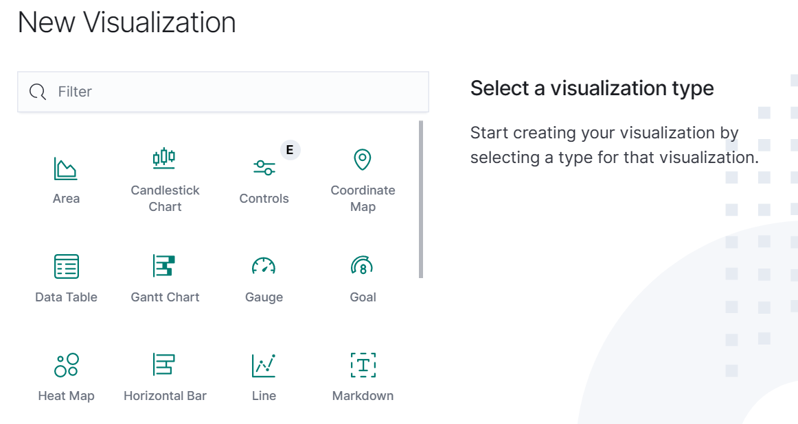

# Candlestick Chart

An OpenSearch Dashboards visulization plugin that provides the capability for creating Candlestick chart and is powered by plotly.js. Candlestick chart can be used to visualize the price movement of security, derivative, or stock over a period of time. By analysing the price pattern in the past, it helps traders to forcast the price value in the future.

---

## Installation

The installation command is given for version `2.6.0`:

```sh
bin/opensearch-dashboards-plugin install https://github.com/igsl-group/osd_candlestick_vis/releases/download/2.6.0/candlestick_vis-2.6.0.zip
```

By running this command, a new visualization `Candlestick Chart` will be available when using the Visualize module in OpenSearch Dashboards.



## Usage

Below demonstrates the steps to create a Candlestick chart.
  1. In the visualizations menu, choose `Create visualization` and `Candlestick Chart`.
  2. Choose a source for the chart (e.g. an index pattern)
  3. Under `Metric` within the `Data` panel, select a document field that corresponds to the `price` which the Open, High, Low, Close value are computed by.
  4. Under `Buckets` within the `Data` panel, configurate the following inputs.
    1. Select a document field that corresponds to the time value 
    2. Select one of the interval options (i.e. Hour, Day, Week, Month, Year)
  5. Under `Panel settings`, customize the chart with y-axis options like position, label and change the Up and down color if required. Rangeslider for chart can also be enabled.
  6. Adjust the time filter on the top right section 
  7. Click `Update`


## Testing

### Integration tests

To perform integration test on this plugin, please follows the below steps.

1. Update the Opensearch Dashboards context url in below configuration in `cypress.config.ts`
```
e2e: {
    baseUrl: 'http://192.168.56.1:5603/tjh',
  }
```

2. Run the below command in project root directory
```
yarn run cypress:open
```